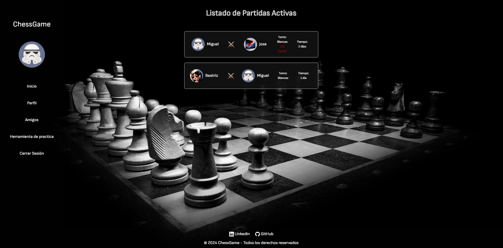
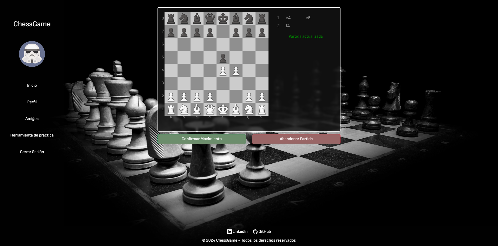

# ChessGame

## Plataforma para jugar al ajedrez por correspondencia (React + JS + PHP)

Para hacer uso de la VERSIÓN DEMO es necesario activar en:

<ul>
<li>Chrome:</li>

chrome://flags --> allow invalid resources from localhost --> ENABLED 

<li>Firefox:</li>

about://config --> privacy.file_unique_origin --> FALSE 

<li>Edge:</li>

edge://flags --> block insecure private network requests --> DISABLED 

</ul>

**VERSIÓN DEMO:** --> [ChessGame](https://chessg4me.000webhostapp.com) <--

Para iniciar el proyecto en local es necesario:

Importar la base de datos --> chessdb.sql

<ul>
  <li>npm install</li>
  <li>npm install axios</li>
  <li>npm install bootstrap</li>
  <li>npm install bootstrap-icons</li>
  <li>npm install react-router-dom</li>
  <li>npm install @material-ui/core</li>
  <li>npm install @material-ui/icons --force</li>
</ul>

**Importante:** Modificar get_connection() para que apunte a tu base de datos (user,pass,params,etc) en el api.php y las rutas en src/services/ApiService.js

Leer el manual de usuario para el uso correcto de la aplicación. Si tiene alguna pregunta o sugerencia sobre la aplicación, pongase en contacto conmigo en la siguiente dirección de correo electrónico: micckey1198@gmail.com
